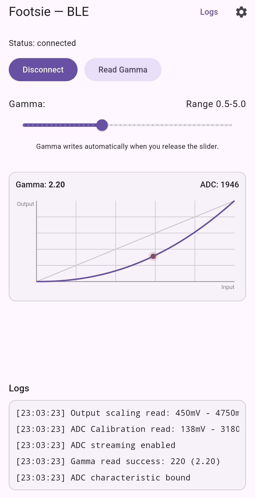
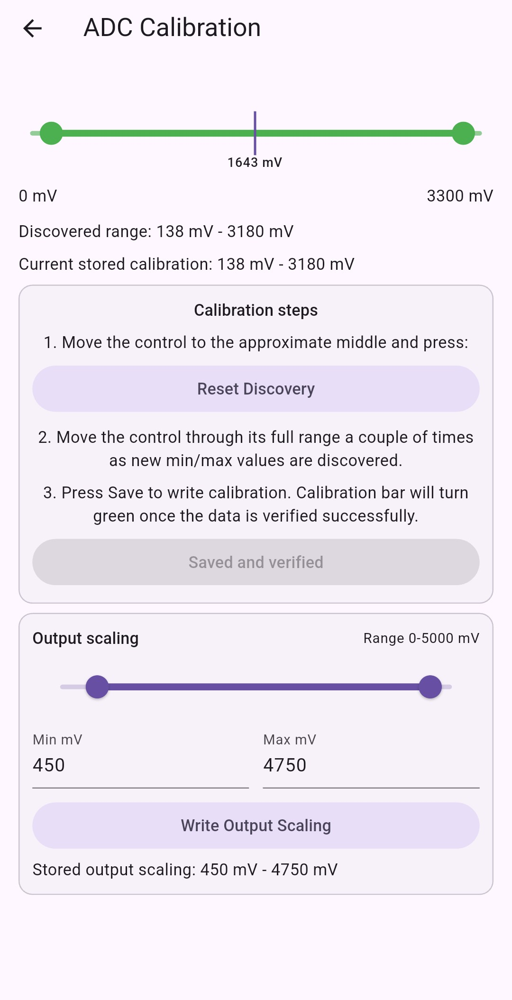

# Footsie App

Flutter BLE companion app for the Footsie device.

This app connects to the Footsie ESP32 firmware, lets you tune gamma response, displays live ADC values, and provides calibration tools for slider/input and output scaling.

## Repositories

- App: this repository
- Firmware: https://github.com/F1nn/Footsie_ESP32_Firmware

## What This App Does

- Scans for nearby BLE peripherals and matches a device name containing `Footsie`.
- Connects and discovers Footsie service characteristics.
- Reads and writes gamma (`0.50` to `5.00`, stored as integer `x100`).
- Streams live ADC readings over BLE notifications.
- Opens a calibration screen to read/write:
	- ADC calibration range (`min mV`, `max mV`)
	- Output scaling range (`min mV`, `max mV`)
- Shows a live throttle curve preview and in-app log output.

## Screenshots

[](images/Footsie_App.jpg)

[](images/Footsie_ADC_Calibration.jpg)

## BLE Protocol (Current App Expectations)

- Service UUID: `501e5b9c-764b-4b18-9d87-796d00008c4a`
- Gamma Characteristic UUID: `4a8c0001-6d79-879d-184b-4b769c5b1e50`
- ADC Characteristic UUID: `4a8c0002-6d79-879d-184b-4b769c5b1e50`
- Slider Calibration Characteristic UUID: `4a8c0003-6d79-879d-184b-4b769c5b1e50`
- Output Scaling Characteristic UUID: `4a8c0004-6d79-879d-184b-4b769c5b1e50`

Data formats:

- Gamma: 2-byte little-endian unsigned integer (`gamma * 100`)
	- Example: `220` means `2.20`
- ADC stream: 2-byte little-endian unsigned integer (mV)
- Slider calibration: 4 bytes total
	- bytes `0-1`: min mV (little-endian)
	- bytes `2-3`: max mV (little-endian)
- Output scaling: 4 bytes total
	- bytes `0-1`: min mV (little-endian)
	- bytes `2-3`: max mV (little-endian)

## Requirements

- Flutter SDK (compatible with Dart `^3.12.2`)
- A physical phone/tablet with BLE support (recommended)
- Footsie device running compatible firmware

## Setup

```bash
flutter pub get
```

## Run

```bash
flutter run
```

For a specific target device:

```bash
flutter devices
flutter run -d <device-id>
```

## Permissions

### Android

Declared in Android manifest:

- `BLUETOOTH`
- `BLUETOOTH_ADMIN`
- `BLUETOOTH_SCAN`
- `BLUETOOTH_CONNECT`
- `ACCESS_FINE_LOCATION`

At runtime, the app requests Bluetooth scan/connect and location permissions before scanning.

### iOS

Declared in Info.plist:

- `NSBluetoothAlwaysUsageDescription`
- `NSBluetoothPeripheralUsageDescription`

## Typical Workflow

1. Tap **Scan & Connect**.
2. Wait for a device whose name contains `Footsie`.
3. After connection, use the gamma slider and release to write a value.
4. Open **Calibration** (gear icon) to tune calibration and output ranges.
5. Use **Logs** for diagnostics and BLE event tracing.

## Project Structure

- `lib/main.dart`: UI, BLE scanning/connection, characteristic read/write, calibration flow, logging, and plot rendering.
- `test/ble_widget_test.dart`: widget smoke test for basic app shell.
- `android/` and `ios/`: platform configuration and permission declarations.

## Testing

Run tests with:

```bash
flutter test
```

## Troubleshooting

- Device not found:
	- Confirm the peripheral advertises a name containing `Footsie`.
	- Ensure Bluetooth/location permissions are granted.
	- Move closer and retry scanning.
- Connected but no gamma control:
	- Firmware may not expose expected UUIDs.
	- Verify the firmware repo and characteristic map.
- Writes appear to fail:
	- Check the Logs screen for read/write errors.
	- Reconnect and retry.
- Android 12+ permission issues:
	- Re-check runtime permission prompts in system settings.

## Notes

- Gamma slider range in app: `0.50` to `5.00` (step `0.10`).
- BLE value parsing/writing uses little-endian byte order.
- App title in UI: `Footsie - BLE`.
